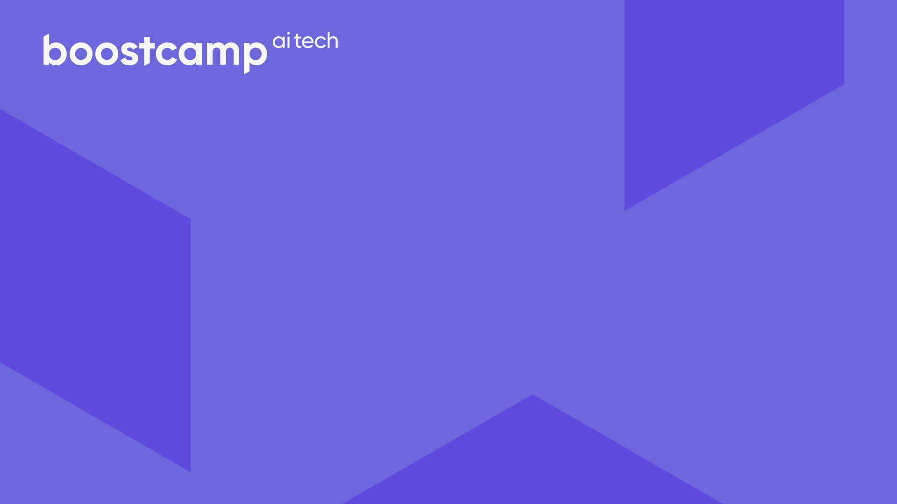
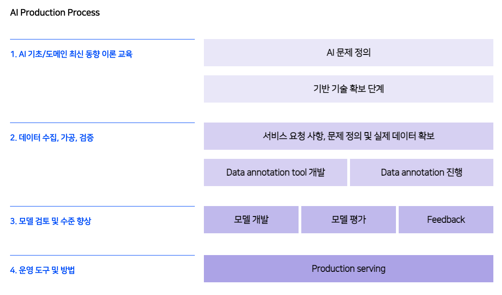
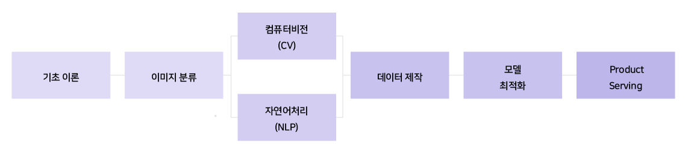

  

<h1 align='center'>Naver BoostCamp AI Tech 2</h1>

  
  
     
  

### Table of Contents

1. [About the Project](#about-the-project)
2. [Path of Growth](#path-of-growth)
3. [U Stage](#u-stage)
4. [P Stage](#p-stage)
5. [Instructors](#instructors)

## About the Project

- 국내 최고 수준의 AI 엔진과 서비스 개발 경험을 가진 업스테이지와 교수진 및 강사진 분들께 받는 최상위 AI 교육과정
- `Aug 02, 2021` ~ `Dec 27, 2021`  

## Path of Growth

- AI Production의 End-to-End를 경험할 수 있다.
- 5주간의 U Stage(이론) + 15주간의 P Stage(프로젝트 실습)으로 구성됨.

- 부스트캠프 교육과정

## U Stage 

- [Python Basics for AI]()

- [Math for AI]()

- [Pytorch for AI]()

- [Deep Learning Basics]()

- [Natural Language Processing](./u-stage/nlp)

## P Stage

- [Image Classification]()

- [KLUE (Korean Language Understanding Evaluation)]()

- [MRC (Machine Reading Comprehension)]()

- [데이터 제작 - NLP]()

- [모델 최적화]()

- [Product Serving]()

## Instructors

- SUNG KIM (UPSTAGE CEO, 전 NAVER Clova AI Head)
- 최성철 (가천대학교 산업경영공학과)
- 임성빈 (UNIST 인공지능 대학원)
- 최성준 (고려대학교 인공지능학과)
- 오태현 (POSTECH, 전자전기공학과)
- 주재걸 (KAIST AI 대학원)
- 이활석 (전 Naver Clova Visual AI/OCR 헤드)
- 박은정 (전 네이버 파파고 AI 모델 팀 리더)
- 김재범 (전 카카오 AI기술팀 헤드)
- 김상훈 (Kaggle 세계 랭킹 12위)
- 문지형 (전 네이버 파파고 AI 모델 팀 리서치 엔지니어)
- 박성준 (Google PhD Fellowship)
- 이준엽 (전 NAVER Clova OCR팀 테크리더)
- 김태진 (번개장터)
- 김현우 (KAIST 산업및시스템공학과)
- 송원호 (KAIST 정보보호 대학원)
- 김성현 (Smilegate AI)
- 김성동 (Naver AI LAB)
- 서민준 (KAIST AI 대학원)

UP Stage and Naver Connect
