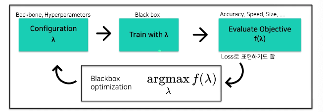

# AutoML 이론

### Table of Contents

1. Overview
2. Basic Concept
3. Further Studies

## 1. Overview

아래 과정의 반복

- 모델선정
- 하이퍼 파라미터 튜닝
- 학습 & 평가

사람이 해야하는 단점. 최적의 모델과 하이퍼파라미터를 찾는 것은 어려움.

#### AutoML

위 파이프라인에서 사람을 빼내자. 

## 2. Basic Concept

일반적인 AutoML Pipeline

목적에 맞는 최적의 모델과 하이퍼파라미터를 찾는것!

**가우시안 분포 : 정규분포**

### Bayesian Optimization

> 사전 정보를 최적값 탐색에 반영하는 것

Bayesian Optimizaion에서 사전 정보를 바탕으로 탐색하기 위해선 다음과 같은 정보가 필요하다.

***1. 어떻게 모델 내에서 사전 정보를 학습하고 자동적으로 업데이트할까?***

- Surrogate Model(Function): $$f(\lambda)$$의 Regression Model
- 기존 입력값((x1, f(x1)), (x2, f(x2)), ...)을 바탕으로, **미지의 목적함수 f의 형태에 대한 확률적인 추정**을 하는 모델

***2. 수집한 사전 정보를 바탕으로 어떤 기준으로 다음 탐색값을 찾을까?***

- Acquisition Function
- Surrogate Model이 목적 함수에 대해 확률적으로 추정한 결과를 바탕으로, 바로 **다음 번에 탐색할 입력값 후보를 추천**해주는 함수
  - **최적값일 가능성이 높은 값** = Surrogate Model에서 함수값이 큰 값
  - **아직 Surrogate Model에서 추정이 불확실한 값** = Surrogate Model에서 표준편차가 큰 값

## 3. Further Studies

### 한계점

- 가장 큰 문제는 한 iteration이 너무 오래걸림.