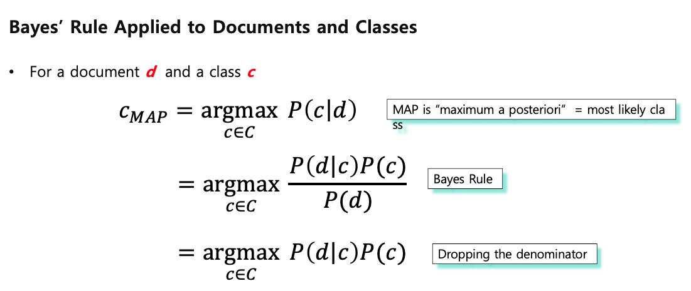
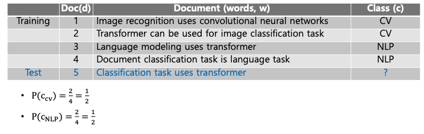
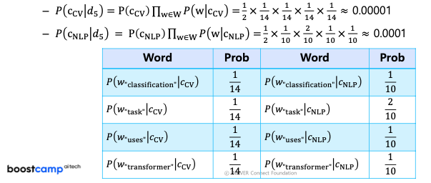
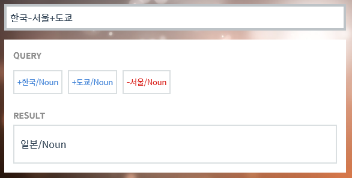
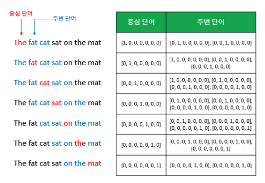
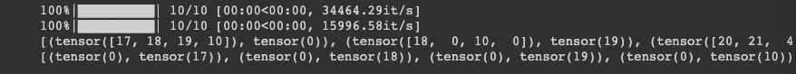

# Day1) Intro to NLP, Bag-of-Words


## 0. NaiveBayes Classifier for Document Classification



위 식을 이해하려면 베이즈 정리에 대해 이해해야 한다. [여기](https://angeloyeo.github.io/2020/01/09/Bayes_rule.html)를 보자.





## 1. Word Embedding

- 단어를 벡터로 표현하는 방법

### 1.1 Sparse Representation

Vector 또는 Matrix의 값이 대부분 0으로 표현되는 방법을 `sparse repersentation` 이라 한다. 따라서 `one-hot vector` 는 `sparse vector` 이다.

sparse vector의 문제점은 단어의 개수가 늘어나면 벡터의 차원이 무한정 커진다는 것이다. 이러한 표현은 공간적 낭비를 불러일으킨다. 또 다른 문제점은 원-핫 벡터는 단어의 의미를 전혀 담지 못한다는 것이다.

### 1.2 Dense Representation

Sparse representation과 반대되는 표현이 `Dense representation` 이다. 사용자가 설정한 값으로 모든 단어의 벡터 표현의 차원을 맞춘다. 이 과정에서 더 이상 0과 1만 가진 값이 아니라 `실수 값` 을 가지게 된다.

Sparse representation

e.g. Apple = [1, 0, 0, 0, ....]

Dense representation

e.g. Apple = [3.8, 1.2, 0.3, -3.2, ... ]

이것을 벡터의 차원이 조밀해졌다고 하여 `Dense vector` 라고 표현한다.

### 1.3 Word Embedding

단어를 `Dense vector` 의 형태로 표현하는 방법을 `Word embedding` 이라 한다. 그리고 이 `Dense vector` 를 워드 임베딩 과정을 통해 나온 결과라고 하여 `Embedding vector` 라 한다.

워드 임베딩 방법론으로는 LSA, Word2Vec, FastText, GloVe 등이 있다.

## 2. Word2Vec

앞서 one-hot encoding 방법은 단어 간 유사도를 계산할 수 없다는 단점이 있다. 따라서 단어 간 유사도를 반영할 수 있도록 단어의 의미를 벡터화 할 수 있는 방법이 필요했고 이를 위해서 사용되는 대표적인 방법이 `Word2Vec` 이다.



[http://w.elnn.kr/search/](http://w.elnn.kr/search/)

위 사이트는 한국어 단어에 대해 벡터 연산을 해볼 수 있는 사이트이다. 위 예를 보면 `한국-서울+도쿄` 연산을 진행하는데, `한국`에서 `서울`을 빼면 `나라`에서 `수도`를 빼고 `다른 수도`를 더한다. `나라`라는 벡터에 `도쿄`라는 벡터가 더해진다는 것으로 이해할 수 있다. 따라서 결과는 `도쿄`가 수도인 `나라`가 나오게 되고, 이것이 `일본`이라 예측해준다. 하나 더 재미있는 예를 들자면, 아래의 예가 있다.

- 박찬호 - 야구 + 축구 = 호나우두

### 2.1 CBOW (Continuous Bag of Words)

Word2Vec에는 CBOW와 Skip-Gram 두 가지 방식이 있다. `CBOW`는 주변에 있는 단어들을 가지고, 중간에 있는 단어들을 예측하는 방법이다. 반대로, `Skip-Gram`은 중간에 있는 단어로 주변 단어들을 예측하는 방법이다. 두 방법의 매커니즘 자체는 거의 동일하다.

**예문 : "The fat cat sat on the mat"**

여기서 sat을 예측하는 것을 CBOW가 하는 일이다. 중심 단어를 `Center Word` 라 하고, 예측에 사용되는 주변 단어를 `Context word` 라고 한다.

중심 단어를 예측하기 위해서 앞, 뒤로 몇 개의 단어를 볼지를 결정했다면 이 범위를 윈도우(window)라고 한다. 아래 이미지는 `window_size = 2` 이다.



윈도우를 계속 움직여서 주변 단어와 중심 단어 선택을 바꿔가며 학습을 위한 데이터 셋을 만드는 것을 `Sliding window` 라고 한다.

### 2.2 Skip-gram

Skip-gram은 중심 단어에서 주변 단어를 예측한다. 여러 논문에서 성능 비교를 진행했을 때, 전반적으로 Skip-gram이 CBOW 보다 성능이 좋다고 알려져 있다.

### Practice

아래 CBOW와 SkipGram 의 x와 y를 생성하는 코드를 보면 다소 차이가 있는 것을 알 수 있다. 따라서 아래 실행코드를 보면 두 Dataset에서 각각 다른 형태의 output을 보여준다.

```python
class CBOWDataset(Dataset):
  def __init__(self, train_tokenized, window_size=2):
    self.x = []
    self.y = []

    for tokens in tqdm(train_tokenized):
      token_ids = [w2i[token] for token in tokens]
      for i, id in enumerate(token_ids):
        if i-window_size >= 0 and i+window_size < len(token_ids):
          self.x.append(token_ids[i-window_size:i] + token_ids[i+1:i+window_size+1])
          self.y.append(id)

    self.x = torch.LongTensor(self.x)  # (전체 데이터 개수, 2 * window_size)
    self.y = torch.LongTensor(self.y)  # (전체 데이터 개수)

  def __len__(self):
    return self.x.shape[0]

  def __getitem__(self, idx):
    return self.x[idx], self.y[idx]
```


```python
class SkipGramDataset(Dataset):
  def __init__(self, train_tokenized, window_size=2):
    self.x = []
    self.y = []

    for tokens in tqdm(train_tokenized):
      token_ids = [w2i[token] for token in tokens]
      for i, id in enumerate(token_ids):
        if i-window_size >= 0 and i+window_size < len(token_ids):
          self.y += (token_ids[i-window_size:i] + token_ids[i+1:i+window_size+1])
          self.x += [id] * 2 * window_size

    self.x = torch.LongTensor(self.x)  # (전체 데이터 개수)
    self.y = torch.LongTensor(self.y)  # (전체 데이터 개수)

  def __len__(self):
    return self.x.shape[0]

  def __getitem__(self, idx):
    return self.x[idx], self.y[idx]
```


```python
cbow_set = CBOWDataset(train_tokenized)
skipgram_set = SkipGramDataset(train_tokenized)
print(list(cbow_set))
print(list(skipgram_set))
```



## 3. GloVe

Glove (Global Vectors for Word Representation, GloVe)는 카운트 기반과 예측 기반을 모두 사용하는 방법론이다. 카운트 기반의 `LSA` (Latent Semantic Analysis)와 예측 기반의 `Word2Vec` 의 단점을 지적하며 이를 보완한다는 목적으로 나왔다.
