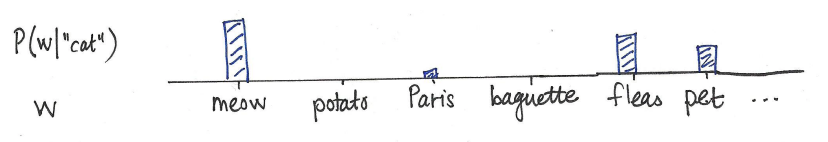
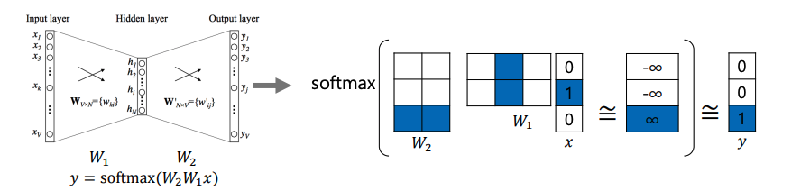
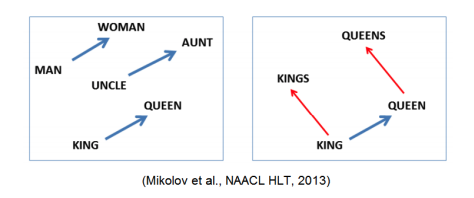
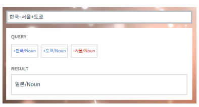

# Day2) Word Embedding

## What is Word Embedding?

- Express a word as a vector
- 'cat' and 'kitty' are similar words, so they have similar vector representations -> `short distance`
- 'hamburger' is not similar with 'cat', so they have different vector representations -> `far distance`

## Word2Vec

- An algorithm for training vector representation of a word from context words
- Assumption: words in similar context will have similar meanings 

#### Idea of Word2Vec

Suppose we read the word "cat"

- What is the probability \mathrm{P}(\underline{\mathbf{w}} \mid \text { cat }) that we'll read the word `w` nearby?

#### How Word2Vec Algorithm Works

#### Property of Word2Vec

The word vector, or the relationship between vector points in space, represents the relationship between whe words. The same relationship is represented as the same vectors.

e.g. vector[queen] - vector[king] = vector[woman] - vector[man]

