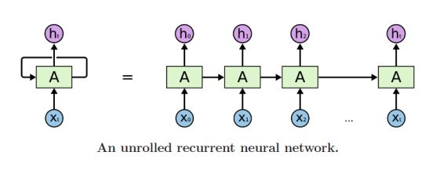
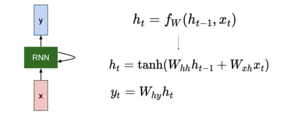
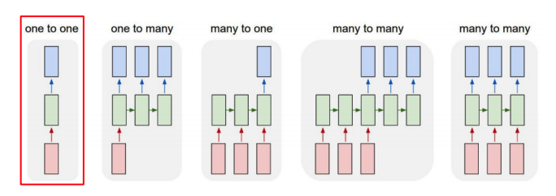
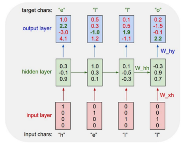
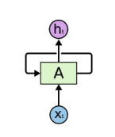
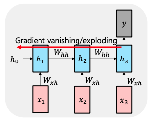

# Basic of Recurrent Neural Networks (RNNs)

## Basic structure

> Notice: The same function and the same set of parameters are used at every time step

하나의 W와 bias를 모든 time step에서 공유한다는 특징이 있다. 기존 CNN과 같은 구조에서는 레이어별로 W와 bias가 따로 존재했는데 RNN은 같은 파라미터를 공유한다.

## Types of RNNs

**One to One**

- Standard Neural Network 구조이다. 

**One to Many**

- e.g. Image captioning
- Input으로 이미지가 들어왔을 때, 이미지에 대한 설명을 sequence 형태의 결과값으로 만들어 준다.

**Many to One**

- e.g. Sentiment Classification
- Input으로 Sequence of Text가 들어왔을 때, Positive or Negative를 결과값으로 가진다.

**Many to Many**

- e.g. Machine Translation
- Input으로 `한글 문장`이 들어갔을 때, `영어 문장`을 결과값으로 출력한다.

**Sequence to sequence**

- e.g. Video classification on frame level
- Input으로 **테니스 영상**이 들어왔을 때, **테니스**라는 결과값으로 분류하는 문제.

## Character-level Language Model

Char 하나씩 input으로 들어가는 모델을 `character-level language model`이라 한다. 위 그림은 `hell`이 들어왔을 때, `o`가 나오도록 하는 것이다. 물론 `h`가 나오고 `e`가 나오고 순서대로 잘 나와야 한다.

그림은 RNN구조를 보다 쉽게 설명하기 위해 unfold 시켜놨지만 실제로는 

와 같은 형태라고 생각하면 된다.

따라서 W_hh, W_xh, W_hy는 모두 같은 파라미터를 공유하고 있다.

> Notice: Inference or Test 시에는 input이 h만 들어가고 output이 다음 input으로 들어가는 구조이다.

## Backpropagation through time (BPTT)

> Run forward and backward through chunks of the sequence instead of whole sequence

BPTT는 forward와 backward를 일정 길이만큼 잘라서 수행하는 것을 말한다. Input Sequence가 매우 긴 경우, 학습이 어렵기 때문에 BPTT를 사용한다.

## Vanishing/Exploding Gradient Problem in RNN

RNN은 긴 Sequence 데이터가 입력으로 주어지면 gradient가 사라지거나 기하급수적으로 증가하는 문제를 갖고 있다. 

위 그림을 예로 W가 0.2라면, backpropagation을 하면서 편미분 값을 계속 곱해주게 되고, 0.2가 무수히 곱해지게 되어서 0으로 소멸해버리는 문제가 발생한다.

또 다른 예로 W가 3이라면 3이 무수히 곱해져서 발산하는 문제가 발생한다. 이것을 해결하기 위해 나온 모델이 `LSTM`과 `GRU`이다.