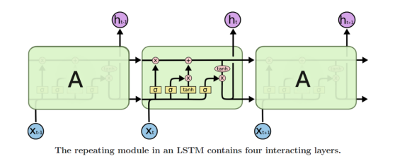
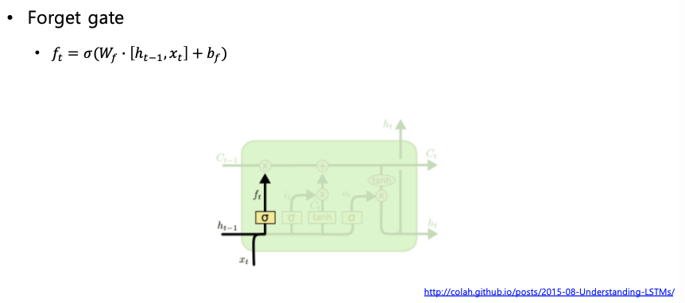

# LSTM & GRU

## Long Short-Term Memory (LSTM)

**Core Idea** : Pass cell state information straightly without any transformation

- Solving long-term dependency problem

LSTM은 크게 4가지 Gate로 구성되어 있다.

- Input gate: whether to write to cell
- Forget gate: whether to erase cell
- Output gate: how much to reveal cell
- Gate gate: how much to write to cell

---

