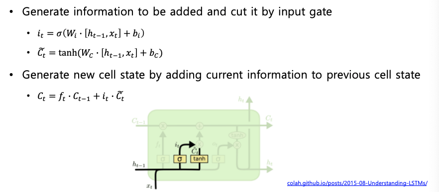
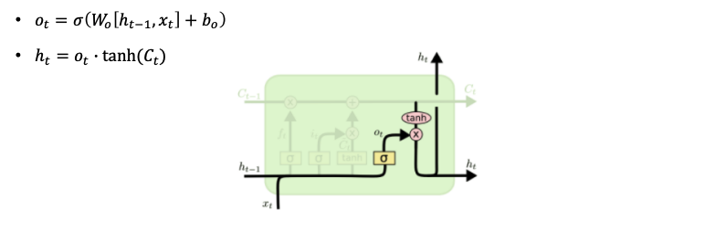
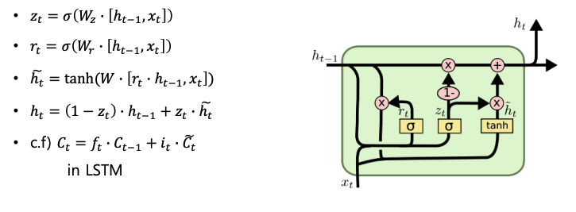

# LSTM & GRU

## Long Short-Term Memory (LSTM)

**Core Idea** : Pass cell state information straightly without any transformation

- Solving long-term dependency problem

LSTM은 크게 4가지 Gate로 구성되어 있다.

- Input gate: whether to write to cell
- Forget gate: whether to erase cell
- Output gate: how much to reveal cell
- Gate gate: how much to write to cell

---

Cell state에 올라가 있는 값을 얼마나 지울지를 결정하는 gate이다. Sigmoid값을 통과해서 나오기 때문에 0~1 사이 값으로 Cell state값을 조절할 수 있다.

다음은 **Input Gate와 Gate gate**이다.

마지막으로 **Gate**..? 라고 불리는 gate 이다.

## GRU

LSTM은 Cell State와 Hidden State 2개가 다음 time step으로 전달되는 반면, GRU는 두가지를 Hidden state로 통합하여 전달된다.

## Summary

- RNNs allow a lot of **flexibility** in architecture design
- Vanilla RNNs are **simple** but don't work very well
- Backward flow of gradients in RNN can **explode or vanish**

- Common to use LSTM or GRU: theri additivie interactions **improve gradient flow**

